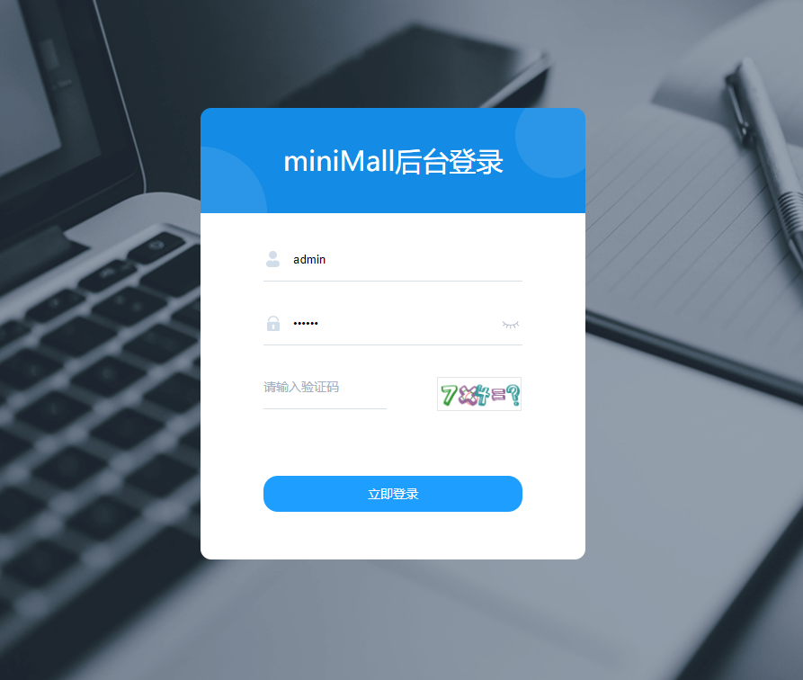
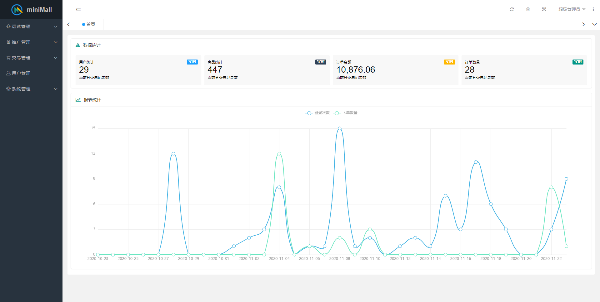
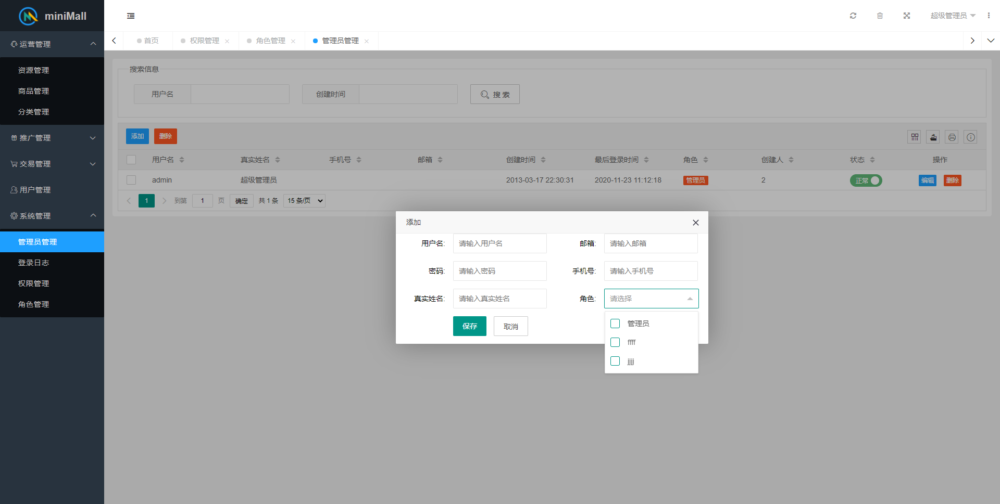
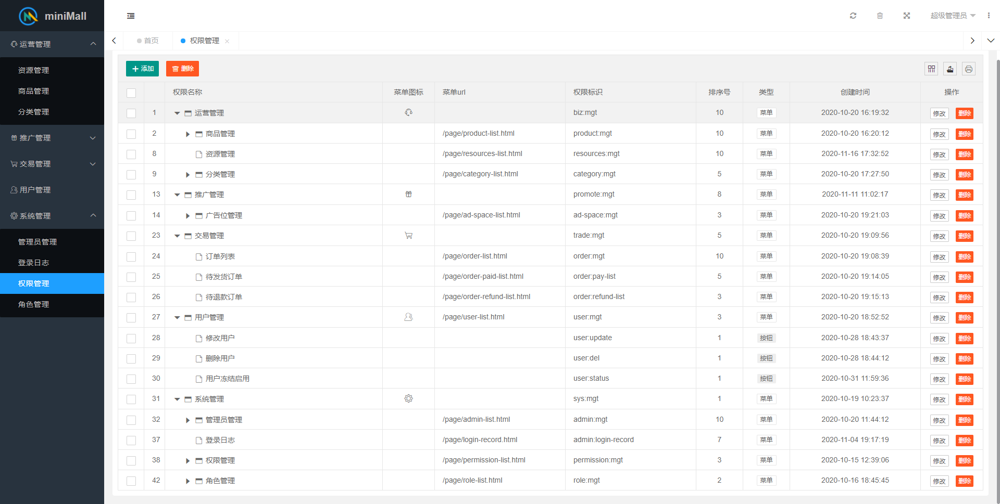
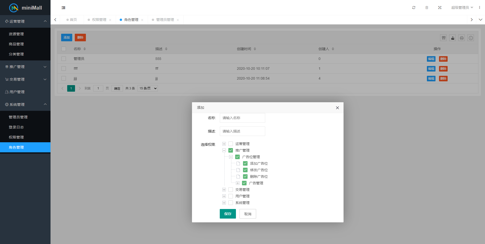
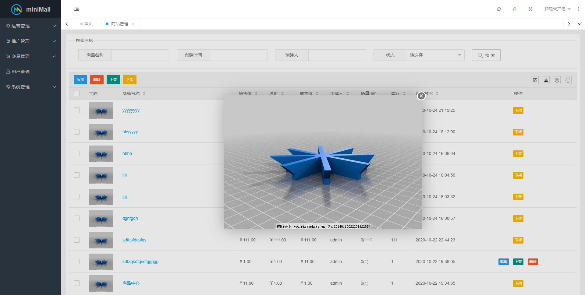
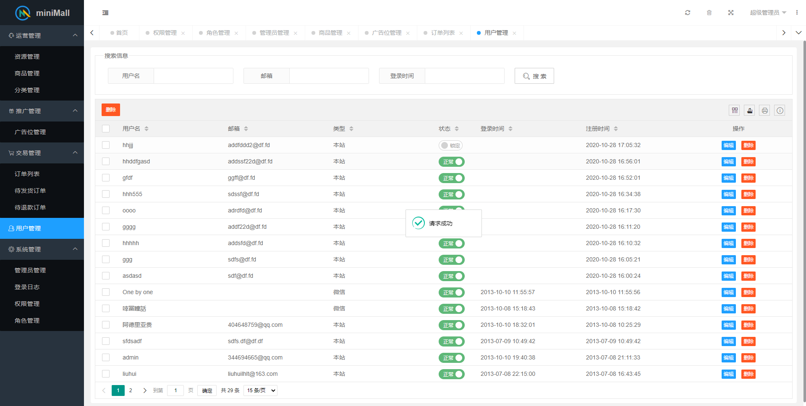

# mini-manager

项目简介

mini-manager项目是一套管理后台系统，基于SpringBoot2.0的后台权限管理系统界面简洁美观敏捷开发系统架构。使用SpringBoot+MyBatis+redis+layuimini实现，
封装elasticsearch做产品搜索。

## 管理后台实例

**如果你喜欢这个开源项目还请点个star**

## 运行环境

* JDK：jdk8+
* 数据库服务器：Mysql
* 缓存：redis
* ide：IntelliJ IDEA

## 快速体验

* 将mini-manager项目源码通过maven形式导入IntelliJ IDEA；
* 导入document/sql/mini-manager.sql数据文件,注意：数据库使用utf-8编码；
* 修改application.yml文件中的数据库设置参数；
* 访问后台地址：http://localhost:8888/
* 管理员账号，用户名：admin 密码：123456

## 目前完成的功能
###### 管理后台

 | 模块  | 功能 |完成度
|  ----  | ----  | ----  | 
| 基本功能  | 登录 | 90%
|  | 退出 | 90%
|  | 修改资料 | 90%
|  | 修改密码 | 90%
| 系统管理  | 管理员管理 | 90%
|  | 角色管理 | 90%
|  | 权限管理 | 90%
| 运营管理 | 产品管理 | 90%
|  | 创建产品 | 90%
|  | 编辑产品 | 90%
|  | 上下架，删除 | 90%
|  | 广告位管理 | 90%
|  | 发布广告 | 90%
|  | 广告项管理 | 90%
| 用户管理 | 用户列表 | 90%
|  | 删除 | 90%
|  | 冻结/解冻 | 90%

#### 特别鸣谢

- 感谢 [layuimini](https://github.com/zhongshaofa/layuimini) 大佬提供的前端模板

